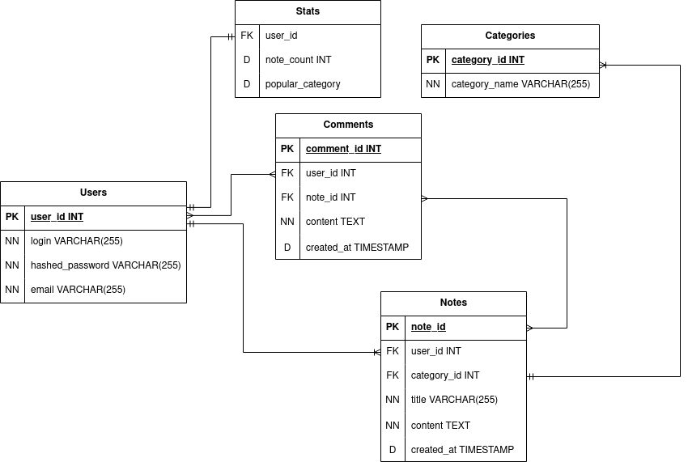

# Лабораторная работа по теме "Работа с заметками"
## Упражнение 1. Работа со страницей default.php 
1. Необходимо создать web-приложение для добавление заметок (последняя добавленная заметка будет отображаться в самом верху списка заметок)
2. Необходимо сделать так, чтобы последняя добавленная заметка отображалась в самом верху списка заметок. 
## Упражнение 2. Работа с комментариями к заметкам 
Добавить возможность добавлять комментарии к заметкам.

# Работа
## База данных

